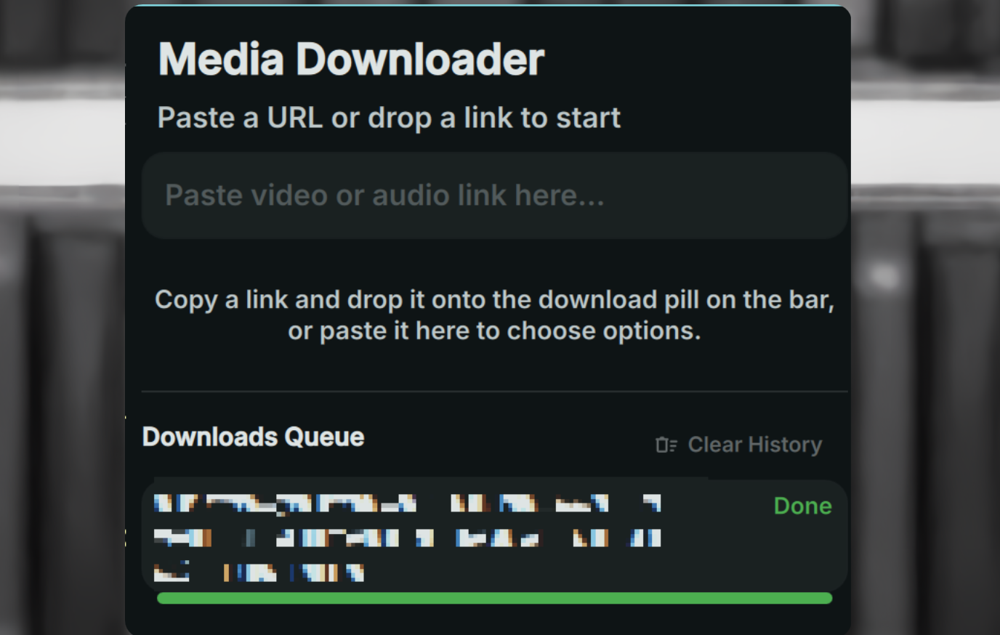

# Media Downloader

Download audio and video from web links using `yt-dlp` directly from your status bar.



## Requirements

- `yt-dlp` - The backend downloader.
- `ffmpeg` - Required for extracting audio formats (like MP3) and merging video streams.

## Install

Use the DMS CLI:
```bash
dms plugins install mediaDownloader
```

Or manually:
```bash
git clone https://github.com/hthienloc/dms-media-downloader ~/.config/DankMaterialShell/plugins/mediaDownloader
```

## Features

- **Drag & Drop URL Input** - Drag and drop any link from your browser onto the bar icon to open download options immediately.
- **One-Click Quick Downloads** - Instantly trigger downloads with pre-defined audio/video presets.
- **Custom Configuration Options** - Specify output formats and quality resolutions on the fly.
- **Persistent Queue** - Downloads run in the background, surviving popout closure.
- **Progress Tracking** - Real-time speed, progress bars, and ETA indicators.

## Usage

| Action | Result |
|--------|--------|
| Drag & Drop link | Pre-fill URL and open popout selection |
| Left click | Toggle popout dashboard |
| Right click | Quick download using current clipboard URL |

## Roadmap / TODO

- [ ] Support password-protected sites (via keychain keyring).
- [ ] Add support for downloading full YouTube playlists into directories.
- [ ] Auto-extract subtitles if available.
- [ ] Speed limit toggle on the fly from the popout.

## Credits

- Inspired by GNOME's [Parabolic](https://github.com/NickvisionApps/Parabolic).

## License

MIT
